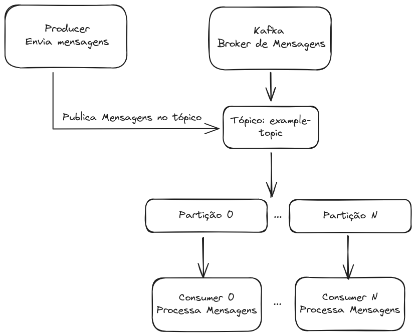
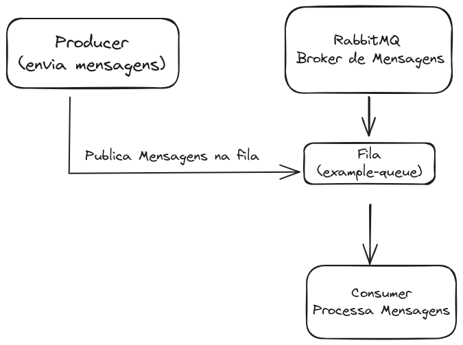

---

# 🚀 Arquitetura orientada a eventos: Mapeamento sistemático da Literatura

Este repositório tem como propósito disponibilizar **tutoriais** sobre a implementação de ferramentas utilizadas na **comunicação entre microsserviços** usando a arquitetura orientada a eventos.

---

## 🛠️ Ferramentas Necessárias

Para executar os exemplos, certifique-se de ter as seguintes ferramentas instaladas:

- **Docker** e **Docker Compose** &nbsp;🐳&nbsp; [Guia de instalação](https://docs.docker.com/compose/install/)
- **Golang** &nbsp;🐹&nbsp; [Documentação oficial](https://go.dev/doc/install)

---

## ▶️ Como Executar

Cada ferramenta contém um tutorial com o passo a passo para execução. Acesse os tutoriais clicando nos links abaixo:

- 📘 **[Kafka](./kafka/description.md)**
- 📗 **[RabbitMQ](./rabbitMQ/description.md)**

---

## 🏗️ Arquitetura Base Apresentada nos Exemplos

### Kafka Example

> Exemplo de arquitetura utilizando Apache Kafka para comunicação assincrona entre serviços.

### RabbitMQ Example

> Exemplo de arquitetura utilizando RabbitMQ para comunicação assincrona entre serviços.

---

## 📂 Estrutura do Repositório

```bash
.
├── kafka
│   ├── compose.yml
│   ├── description.md
│   ├── golang-football-example
│   │   ├── analytics_consumer.go
│   │   ├── go.mod
│   │   ├── go.sum
│   │   ├── main.go
│   │   ├── notify_consumer.go
│   │   └── producer.go
│   ├── golang-simple-example
│   │   ├── go.mod
│   │   ├── go.sum
│   │   └── main.go
│   └── kafka.excalidraw.json
├── kafka-architecture.png
├── LICENSE
├── rabbitMQ
│   ├── compose.yml
│   ├── description.md
│   ├── golang-football-example
│   │   ├── analytics_consumer.go
│   │   ├── go.mod
│   │   ├── go.sum
│   │   ├── main.go
│   │   ├── notify_consumer.go
│   │   └── producer.go
│   ├── golang-simple-example
│   │   ├── go.mod
│   │   ├── go.sum
│   │   └── main.go
│   └── rabbitMQ.excalidraw.json
├── rabbitMQ-architecture.png
└── README.md
```

---

## 📝 Licença

Este projeto está licenciado sob a licença [MIT](./LICENSE).

---

## 📧 Contato

Se tiver dúvidas ou sugestões, sinta-se à vontade para abrir uma **issue** ou entrar em [contato](https://github.com/lucassanascimento)!

---

### 🔗 Links Úteis

- **Documentação oficial do Docker**: [https://docs.docker.com](https://docs.docker.com)
- **Documentação oficial do Go**: [https://go.dev](https://go.dev)

---

### 🌟 Dicas

- Certifique-se de que o Docker está rodando corretamente antes de iniciar qualquer exemplo.
- Confira a documentação específica de cada ferramenta para mais detalhes sobre as opções de configuração.
---
